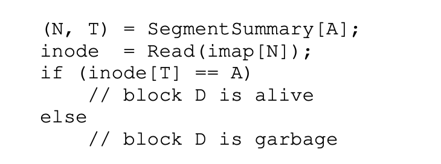

## LFS

### 什么是LFS

在90年代初，由John Ousterhout教授和研究生Mendel Rosenblum领导的伯克利的一个小组开发了一个新的文件系统，称为日志结构文件系统。他们这样做的动机是基于以下观察：

* 系统内存正在增长。随着内存变大，更多的数据可以被缓存在内存中。随着更多的数据被缓存，磁盘流量越来越多地包括写入，因为读取是由缓存提供服务的。因此，文件系统的性能在很大程度上由其写入性能决定。
* 随机I/O性能和顺序I/O性能之间存在很大差距。多年来，硬盘的传输带宽有了很大的提高；随着更多的比特被装入硬盘的表面，访问这些比特的带宽也在增加。然而，寻道和旋转延迟的成本却下降得很慢；要使廉价的小型电机更快地旋转盘片或更快地移动盘臂是很有挑战性的。因此，如果你能够以顺序的方式使用磁盘，你就会比导致寻道和旋转的方法获得相当大的性能优势。
* 现有的文件系统在许多常见的工作负载上表现不佳。例如，FFS将执行大量的写操作来创建一个大小为一个块的新文件：一个用于新的节点，一个用于更新节点位图，一个用于文件所在的目录数据块，一个用于目录节点的更新，一个用于作为新文件一部分的新数据块，一个用于数据位图以标记数据块为分配。因此，尽管FFS将所有这些块放在同一个块组中，但FFS会产生许多短的寻求和随后的旋转延迟，因此性能远远达不到峰值顺序带宽。
* 文件系统不具有RAID意识。例如，RAID-4和RAID-5都有一个小写的问题，即对一个块的逻辑写会导致4个物理I/O的发生。现有的文件系统并不试图避免这种最坏情况下的RAID写入行为。

因此，一个理想的文件系统将专注于写入性能，并试图利用磁盘的顺序带宽。此外，它在常见的工作负载上表现良好，不仅写出数据，而且还经常更新磁盘上的元数据结构。最后，它在RAID和单块磁盘上都能很好地工作。

Rosenblum和Ousterhout介绍的新型文件系统被称为LFS，即日志结构化文件系统的简称。当写入磁盘时，LFS首先在一个内存段中缓冲所有的更新（包括元数据！）；当该段满时，它被写入磁盘，以一个长的顺序传输到磁盘的一个未使用部分。LFS永远不会覆盖现有的数据，而总是将段写到空闲的位置。由于片段很大，磁盘（或RAID）被有效利用，文件系统的性能接近顶峰。

### 高效且顺序性的写入

### 如何找到Inodes

为了理解我们如何在LFS中找到一个inode，让我们简单回顾一下如何在一个典型的UNIX文件系统中找到一个inode。在一个典型的文件系统中，如FFS，甚至是旧的UNIX文件系统，寻找inode是很容易的，因为它们被组织在一个阵列中并被放置在磁盘的固定位置。
例如，旧的UNIX文件系统将所有的节点放在磁盘的一个固定部分。因此，给定一个节点号和起始地址，要找到一个特定的节点，你可以简单地通过将节点号乘以一个节点的大小，再加上磁盘阵列的起始地址来计算其准确的磁盘地址；基于阵列的索引，给定一个节点号，是快速而直接的。

在FFS中找到一个给定的inode号码只是稍微复杂一些，因为FFS将inode表分成了几块，并将一组inode放在每个圆柱体组中。因此，我们必须知道每块节点有多大，以及每个节点的起始地址。在这之后，计算是类似的，也很容易。

在LFS中更加困难。我们已经设法把inode分散到了整个磁盘上！更糟糕的是，我们从来没有在原地覆盖过，因此，最新版本的inode（即我们想要的那个）一直在移动。更糟的是，我们从不在原地覆盖，因此，一个节点的最新版本（即我们想要的那个）一直在移动。

### Inode Map

为了解决这个问题，LFS的设计者通过一个叫做inode map（imap）的数据结构，在inode号码和inode之间引入了一个间接的层次。imap是一个将节点号作为输入并产生该节点最新版本的磁盘地址的结构。因此，你可以想象它通常被实现为一个简单的数组，每个条目有4个字节（一个磁盘指针）。任何时候一个inode被写入磁盘，imap就会以其新的位置被更新。

不幸的是，imap需要保持持久性（即写入磁盘）；这样做可以使LFS在崩溃时跟踪节点的位置，从而达到预期的操作。因此，有一个问题：imap应该存放在磁盘的什么地方？

当然，它可以住在磁盘的一个固定部分。不幸的是，由于它经常被更新，这将需要在更新文件结构之后再写入imap，因此性能会受到影响（也就是说，在每次更新和imap的固定位置之间会有更多的磁盘搜索）。

相反，LFS将inode地图的几块放在它正在写入所有其他新信息的地方旁边。因此，当把一个数据块追加到一个文件k时，LFS实际上是把新的数据块、它的inode和inode map的一个部分一起写到磁盘上，如下所示。

在这幅图中，存储在标记为imap的块中的imap数组片段告诉LFS，节点k在磁盘地址A1；这个节点反过来告诉LFS，它的数据块D在地址A0。

### The Checkpoint Region

我们如何找到inode map，现在它也分布在磁盘上了？文件系统必须在磁盘上有一些固定的、已知的位置来开始查找文件。

LFS在磁盘上就有这样一个固定的地方，被称为检查点区域（CR）。检查点区域包含指向inode map最新部分的指针（即地址），因此可以通过首先读取CR来找到inode map部分。请注意，检查点区域只是定期更新（比如每30秒左右），因此性能不会受到不良影响。因此，磁盘上布局的整体结构包含一个检查点区域（它指向最新的inode map）；inode mao各自包含节点的地址；节点指向文件（和目录），就像典型的UNIX文件系统。

这里是一个检查点区域的例子（注意它一直在磁盘的开头，在地址0处），以及一个单一的imap块、inode和数据块。一个真正的文件系统当然会有一个大得多的CR（事实上，它会有两个，我们将在后面理解），许多imap块，当然还有更多的inode、数据块等等。

 

### 目录

到目前为止，我们已经简化了我们的讨论，只考虑了inodes和数据块。然而，要访问文件系统中的一个文件，也必须访问一些目录。那么，LFS是如何存储目录数据的呢？

幸运的是，目录结构基本上与经典的UNIX文件系统相同，因为一个目录只是一个（名称，节点号）映射的集合。例如，当在磁盘上创建一个文件时，LFS必须同时写入一个新的inode，一些数据，以及指向这个文件的目录数据及其inode。请记住，LFS将在磁盘上按顺序这样做（在缓冲更新一段时间后）。因此，在一个目录中创建一个文件foo将导致磁盘上出现以下新结构。

inode map这一块包含了目录文件dir和新创建的文件f的位置信息。因此，当访问文件foo（节点号为k）时，你首先会在节点地图（通常缓存在内存中）中查找目录dir的节点位置（A3）；然后你读取目录的节点，它给你目录数据的位置（A2）；读取这个数据块给你（foo, k）的名字到节点号的映射。然后你再次查阅inode map，找到节点号k的位置（A1），最后在地址A0处读取所需的数据块。

在LFS中还有一个严重的问题，被称为递归更新问题，inode map解决了这个问题。这个问题出现在任何从不就地更新的文件系统中（比如LFS），而是将更新转移到磁盘上的新位置。

具体来说，每当一个inode被更新时，它在磁盘上的位置就会改变。如果我们不小心的话，这也会导致指向该文件的目录的更新，这将要求改变该目录的父目录，以此类推，一直延伸到文件系统树。

LFS巧妙地用inode map避免了这个问题。即使一个节点的位置可能发生变化，但这种变化永远不会反映在目录本身；相反，imap结构被更新，而目录保持相同的名称到节点数的映射。因此，通过间接性，LFS避免了递归更新的问题。

### 垃圾回收

你可能已经注意到LFS的另一个问题；它重复地将一个文件的最新版本（包括其inode和数据）写入磁盘上的新位置。这个过程虽然保持了写入的效率，但意味着LFS会将文件结构的旧版本散落在磁盘上。我们（相当不客气地）称这些旧版本为垃圾。

那么，我们应该如何处理这些旧版本的节点、数据块等呢？我们可以保留这些旧版本，并允许用户恢复旧的文件版本（例如，当他们不小心覆盖或删除一个文件时，这样做可能相当方便）；这样的文件系统被称为版本文件系统，因为它可以跟踪一个文件的不同版本。

然而，LFS只保留文件的最新版本；因此（在后台），LFS必须定期找到这些旧的文件数据、inodes和其他结构的死亡版本，并对其进行清理；因此，清理应该使磁盘上的块再次释放，以便在随后的写入中使用。请注意，清理的过程是一种垃圾收集的形式，这种技术出现在编程语言中，为程序自动释放未使用的内存。

早些时候，我们讨论了段的重要性，因为它们是LFS中实现向磁盘大量写入的机制。事实证明，它们对于有效的清理也是不可或缺的。想象一下，如果LFS清洁器在清洁过程中只是简单地去释放单个数据块、inodes等，会发生什么。其结果是：一个文件系统在磁盘上的分配空间中混有一些空闲的洞。写入性能将大大下降，因为LFS将无法找到一个大的连续区域来连续地、高性能地写入磁盘。

相反，LFS清理器是在逐段工作的基础上进行清理的，从而为后续写入清理出大块的空间。基本的清理过程是这样的。定期地，LFS清理器读入一些旧的（部分使用的）段，确定哪些块在这些段中是活的，然后写出一组新的段，其中只有活的块，释放出旧的段供写入。具体来说，我们希望清洁器能够读入M个现有的段，将它们的内容压缩成N个新的段（其中N<M），然后将N个段写入磁盘的新位置。然后，旧的M段被释放，可以被文件系统用于后续的写入。

### 确定块仍在使用

### GC策略

在上述机制的基础上，LFS必须包括一套策略来决定何时清理和哪些块值得清理。确定什么时候清理比较容易；要么是定期，要么是在空闲时间，要么是在磁盘满了而不得不清理的时候。

确定哪些区块需要清理是比较有挑战性的，这也是许多研究论文的主题。在最初的LFS论文中，作者描述了一种试图分离热段和冷段的方法。热区段是指内容经常被覆盖的区段；因此，对于这样的区段，最好的策略是在清理前等待很长时间，因为越来越多的块被覆盖（在新的区段），从而被释放出来使用。相反，一个冷段可能有一些死块，但其余内容相对稳定。因此，作者得出结论，应该早点清理冷段，晚点清理热段，并开发了一种启发式方法，正是这样做的。然而，与大多数策略一样，这个策略并不完美。