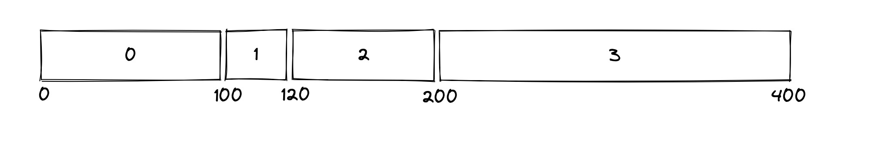

# 一、开发背景

Flash 介质因本身的擦除特性，给上层文件系统带来与普通磁盘、内存文件系统不同的数据管理模式。同时，Flash 的写入放大、寿命以及后期稳定性下降等问题也给文件系统的设计带来的一定的挑战。传统的 Flash 文件系统并没有很好地解决这些稳定性相关问题。

Flash Memory 是一种非易失性的存储器。在嵌入式系统中通常用于存放系统、应用和数据等。在 PC 系统中，则主要用在固态硬盘以及主板 BIOS 中。另外，绝大部分的 U 盘、SDCard 等移动存储设备也都是使用 Flash Memory 作为存储介质。根据硬件上存储原理的不同，Flash Memory 主要可以分为 NOR Flash 和 NAND Flash 两类。

Flash的主要特性：

* 需要先擦除再写入。
* 块擦除次数有限。
* 读写干扰。

这些特性带来了以下问题：

* 擦写均衡。
* 坏块管理。
* 错误检测和数据修正。

传统的文件系统的布局和设计都采用了本地更新的方式，即直接覆盖原有数据写入，无法在Flash介质上直接运行原有逻辑。但是我们大家平时使用的笔记本电脑大多使用SSD存储，SSD也是一种广泛使用的Flash介质。传统的文件系统之所以可以继续运行的原因在于FTL的存在。FTL是一种解决方式，他内部实现了LBA到PBA的映射、垃圾回收、擦写平衡等一系列功能。

我们希望寻找一种更智能、更合适的 Flash 文件系统设计，来更好地平衡 Flash 的性能与稳定性。

# 二、摘要

我们基于以上背景使用纯Rust实现了新型的文件系统WondKV。我们重新设计了磁盘布局，通过将KV引擎内嵌入文件系统，并且KV引擎直接管理磁盘上的某一区域，实现了和绝大多数文件系统不一样的架构模式。并且WondKV为直接管理Flash而生，是Flash友好的文件系统。

目前开源地址：https://github.com/WondFS/WondFS-fuse


完成情况：

* 可以在Linux上完成挂载。
* 支持基本的文件系统接口。
* 支持写入Cache和读Cache。
* 支持自适应的Flash纠错编码。
* 支持坏块管理。
* 支持huffman编码和Snappy编码的数据压缩，平衡计算性能于Flash写入性能。
* 重新设计了擦除块选择算法、数据块迁移算法、平衡各擦除块寿命、减少写入放大。

# 三、基本定义

ino：inode的ino number

Page：4KB 写单元

Block：512KB 读单元 写单元

Region：N个Block组成的具有一定功能的区域

文件和目录都是文件，没有本质区别

文件组成：元数据、数据

如果文件是目录文件，在数据中存储的是固定格式的数据项，例如（ino, name）

# 五、Disk Layout


### Super Region

只读区域，记录文件系统元数据。

### BIT Region

每32字节对应Main Area区域一个block的使用情况。

16字节128位 0 clean 1 used/dirty。

4字节 上次擦除时间。

4字节 擦除次数。

4字节 块平均生命周期。

Tips：当修改过程发生断电，文件系统重新挂载后发现第二个Block有数据，就写入第一个Block，并清空第二个Block，保障原子性。

### PIT Region

存储Main Area区域page的使用情况。

0 未使用 u32 page中所存储数据对应inode的ino。

两种存储编码：serial、map。

serial适用于使用中的page数量多的情况。

map适用于使用中的page数量少的情况。

### Journal Region

垃圾回收的日志区域，记录垃圾回收的日志，实现垃圾回收时的掉电保护。

### KV Region

核心Region，使用LSM-Tree实现，能进行的优化非常多。LSM-Tree自身的更新特性契合Flash异地更新的需求。

相比传统的B-Tree，LSM-Tree具备有以下的特性：

* LSM-Tree具备批量写入特性，能够将小数据的random write化为sequence batch write来适配flash的特性，从而提高写性能。
* 以append-only的形式添加数据，而不是update-in-place，这样的形式可以避免因为一小部分数据的修改引起flash中大量的page数据进行迁移。

实现下列键值对的存储：

- 给定ino，返回inode对应的所有文件元数据。
- 给定路径，返回路径该路径下包含的ino和文件名称，若该路径对应的文件是目录文件，返回的是ino和文件名称列表，若该路径对应的文件是普通文件，返回的是单个ino和文件名称。

给定/home/a.txt路径获取inode的过程示例1：

- 取出/根目录，根目录的ino为1。
- 根据ino为1从KV中取出/根目录的元数据，/根目录的元数据包含了/根目录文件所有数据块的位置，读出/根目录的所有数据块，就可以知道/根目录下包含了哪些文件。
- 找到/根目录下的home文件，home文件也是目录文件，home文件的ino记录在/根目录的数据块中，假设为2。
- 根据ino为2从KV中取出/home文件的元数据，根据元数据读出/home的所有数据块。
- 找到/home目录下a.txt文件的ino，假设为3。
- 根据ino为3从KV取出/home/a.txt的元数据，构造inode并返回。

给定/home/a.txt路径获取inode的过程示例2：

- 取出/根目录。
- 根据/根目录从KV中取出/根目录下的所有文件名。
- 找到/home文件。
- 根据/home从KV中取出/home下所有的文件名。
- 找到/home/a.txt，取出ino。
- 根据ino从KV中取出/home/a.txt的元数据，构造inode并返回。

Tips：实例2是依据KV系统对访问某一路径下文件的优化，如果KV只存储Inode的元数据，那么需要多次读取目录文件的数据块，造成一定开销。这里和OSDI那篇论文是不完全一样的，那篇论文KV中存的是路径和ino，文件名称的对应关系，inode需要去disk中读，我们这里把所有文件元数据都存在了KV中。

### Main Area

在Flash介质中占据最大部分，以Page为单位存储文件数据值得一提的是，Main Area中只存储文件的数据内容，文件的元信息全部交给KV Region管理。

### Reserved Region

* 坏块管理，存储LBA/PBA表

* 存储数据的校验签名信息给
* GC和Wear Levelling留下极大的腾挪空间
* 减少写入放大

# 六、架构设计


# 七、Disk Layer

MTD将 Nand Flash,nor flash 和其他类型的 flash 等设备,统一抽象成MTD 设备来管理,根据这些设备的特点,上层实现了常见的操作函数封装。通过调用linux ioctl对mtd进行io管理。

## 相关数据结构

mtd_oob_buf

* start: u32,

* length: u32,

* ptr:CString


erase_info_user

* start: u32,

* length: u32


mtd_info_user 

* tp: u8,

* flags: u32,

* size: u32, 

* erasesize: u32,

* writesize: u32,

* oobsize: u32, 

* padding: u64  


### MEMGETINFO

获取mtd相关信息，包括设备类型，大小，读写缓冲大小，擦写大小等。

#### MEMERASE

对MTD执行擦除操作。

#### MEMWRITEOOB

对MTD执行写操作。

#### MEMREADOOB

对MTD执行读操作。

# 八、Translation Layer

## 基本设计

Translation Layer的设计来源于FTL（Flash Translation Layer），但是在功能和目的上都与FTL有很大的不同。在介绍Translation Layer之前，我们需要先了解FTL。FTL的具体细节和技术调研在WondFS-doc/技术调研/ftl.md中有收录。

在WondFS的设计中，磁盘可以分为这样几大区域，Super Region、BIT Region、PIT Region、Journal Region、KV Region、Main Area、Reserved Region。Translation Layer通过使用Reserved Region来实现功能。

在Reserved Region中的block可以被分为这样几类：

* MappingTable：存储物理地址、逻辑地址的映射关系。
* Signature：存储数据签名。
* Used：被用作坏块映射。
* Unused：未被使用的。
* Unknown：未知。

简单介绍一下每一种block的功能。

因为Flash中的数据块在使用过程中，可能会出现坏块，即数据损毁的情况，当一个正在使用中的数据块损坏了，我们需要将其映射到一个可用的空白块中，这是因为连续的逻辑地址更便于上层的实现，这是坏块管理的一部分。我们需要将逻辑地址和物理地址之间的映射关系持久化到Flash中，在这里，我们会将其写在类型为MappingTable的物理块中。需要着重注意的是，FTL中也有这样一层的映射，但这里的两个映射其实是截然不同的，FTL的映射是为了给上层的传统针对机械硬盘设计的文件系统提供一个模拟块设备的接口。但是Translation Layer的映射只会发生在出现坏块的情况下，也就是正常的块的物理地址和逻辑地址是相同，并不需要持久化存储，这对于存储来说也是一种优化。当Reserved Region中的某一数据块被用于坏块管理，代替原有的旧块时，会被标记为Used类型。类型为Signature的数据块中存储的是Flash写入数据时的编码信息，每次对于一个page的写入，会生成128bit的签名，用于纠错和校验。当挂载文件系统时，会读取这些签名的位置信息，将数据对应的签名位置存储在内存中，从而加速读取数据时的校验。

## 主要功能

### 写入缓存

写入缓存使用文件系统内存缓存文件的写入命令和数据，然后之后再将其推送到持久化存储中。由于应用程序不必等待I/O真实地将其数据写入物理存储中，所以通过写入缓存可以提高系统性能。

由于写入缓存将数据缓存在内存中以提高系统性能，因此副作用就是：如果出现任何断电、系统崩溃或设备故障，就可能会丢失信息。

以Windows为例，Windows 10会为内置驱动器默认启用磁盘写入缓存以提升性能，对移动磁盘、U盘等外部磁盘则是默认禁用磁盘写入缓存，以防数据丢失和实现热插拔。

WondFS默认开启写入缓存，大部分数据的写入都会先写入写入缓存，但同样提供了绕开写缓存的接口函数，可以满足文件系统中的某些功能模块的特定需求直接写入磁盘。

### 坏块管理

坏块是有数据发生错误的区域，可以分为两种情况，可纠正的错误和不可纠正的错误。当发生不可纠正的错误时，就需要为逻辑地址重新映射一个新的物理块。

### 纠错编码

纠错编码算法是传输过程中发生错误后能在接收端自行发现并纠正的码。早期被广泛应用于通信领域，在发送端完成数据编码，接收端完成数据译码，保证数据的可靠传输。NAND Flash作为一种广泛使用的存储介质，容易受到PE次数、数据保存时间、温度和Cell间干扰等因素的影响，数据写入后再读出无法保证绝对的正确性，因此需要ECC算法做数据恢复。合适的编码算法不仅保证了数据的正确性，还可以延长Flash 介质的寿命。

在这里，我们期望设计一种自适应的Flash纠错编码，达到稳定性和性能的平衡。

我们调研了常用的编码算法，最终采用并实现了两种常用的编码方式，并根据Flash介质的使用情况，智能地选择相应的编码方式，从而达到我们预设的期望。在存储数据期间不会验证数据，但是在请求数据时会测试是否有错误。如果需要的话，在检测之后会进行纠错阶段，如果错误超过了纠错能力，就会将读取的数据块标记为坏块。

**CRC32**

CRC的全称是循环冗余校验。CRC检测能力极强，开销小，易于用编码器及检测电路实现。从其检测能力来看，他所不能发现错误的几率仅为0.0047%以下。从性能上和开销上考虑，均远远优于奇偶校验及算数和校验等方式。因此，在数据存储和数据通讯领域，CRC可谓是无处不在。CRC按照编码后的长度可以分为CRC8、CRC16、CRC32等。我们使用的是CRC32，即编码后的长度是32bit。

**ECC**

ECC可以检查读取或传输的数据是否有错误，并在发现错误后立即对其进行纠正。ECC与奇偶校验类似，除了它在检测到错误后立即纠正错误。ECC在数据存储和网络传输硬件领域变得越来越普遍，尤其是随着数据速率和相应错误的增加。

**自适应纠错编码**

CRC32是一个性能极高的校验算法，我们在写入数据时默认采用CRC32的方式在Reserved Region更新校验信息。

切换ECC的条件：

* 坏块比例达到0.02。
* 使用寿命达到2/3。
* 出现坏块时间周期足够小。

当数据错误出现的概率较高时，我们使用需要更大计算量但可以提高稳定性的ECC编码方式。

**可拓展性**

每一个Page 4096KB的写入，我们会为其分配128bit的空间用于存储纠错校验信息。128bit记录了使用的校验算法，写入Page位置以及生成的签名。128bit的空间这意味着我们可以直接增加其他编码算法，具有非常高的可拓展性。

## 功能实现

### WriteCache

#### 相关数据结构

**WriteBuf**

* address
* data

写缓存中缓存的数据项，标识一次写记录。

**WriteCache**

* capacity
* cache
* table
* sync

写缓存的容量默认为32，cache用于存储WriteBuf，table哈希表用于标识一条写记录是否存在，避免过多重复的查找。sync标识写缓存的使用情况，是否需要将写缓存中的数据同步到物理存储中。

#### 关键函数

**write**

在写缓存中插入一条写记录。

**read**

从写缓存中读取一条写记录。

**get_all**

读出写缓存中的所有写记录。

**recall_write**

撤回写缓存中的一条写记录，当发生擦写操作时，需要撤回相关page缓存在写缓存中的写记录，避免不必要的写入。

**need_sync**

返回写缓存使用情况，如果写缓存满了，需要将缓存中的写记录持久化到物理存储中。

**sync**

持久化写缓存中的内容后调用，清空写缓存。

### CheckCenter

#### 相关数据结构

**CheckType**

* Crc32
* Ecc

用于区分Page所使用的纠错校验算法。

**CheckCenter**

提供一系列纠错校验算法的使用和相关使用函数。

#### 关键函数

**check**

输入page的数据，以及对应的signature，返回校验结果，如果校验发现有数据位发生错误，且错误在可接受修正范围内，返回修复后的数据。

**sign**

输入page的数据，以及纠错校验所需要使用的算法，生成对应的128bit signature。

**extract_address**

输入signature，返回这个signature所属page的address。

### TranlsationLayer

#### 相关数据结构

**BlockType**

* MappingTable
* Signature
* Used
* Unused
* Unknown

标志Reserved Region数据块的用途。

**TranslationLayer**

* disk_manager
* write_cache
* used_table
* map_v_table
* sign_block_map
* sign_offset_map
* use_max_block_no
* max_block_no
* table_block_no
* sign_block_no
* sign_block_offset
* write_speed
* read_speed
* block_num
* err_block_num
* last_err_time

TranslationLayer是Translation Layer的主要控制类。disk_manager持有下层的磁盘管理类。write_cache是写入缓存，used_table存储了Reserved Region中已经被使用的块，map_v_table存储了坏块的映射关系，当出现坏块时，将坏块的逻辑地址映射到Reserved Region中一个还未被使用的块中。sign_block_map和sign_block_offset存储了Main Area中page数据对应的签名位置。use_max_block_no是上层能够使用的最大逻辑块号，即上层不允许直接操作Reserved Region，max_block_no是磁盘的最大块号。table_block_no存储的是MappingTable块的位置，sign_block_no和sign_block_offse存储的是当前可写入签名的位置，当一个数据块写入签名写满后，需要寻找一个空白块作为后续的签名存储。Translation Layer直接访问Disk Layer，write speed和read speed记录了Disk Layer的平均读写速率。block_num是磁盘的所有块的数量，err_block_num是坏块的数量。last_err_time记录了上次坏块的出现时间。

#### 关键函数

**init**

初始化Translation Layer，为WondFS建立起Translation Layer的视图。

执行流程：

* 根据use_max_block_no和max_block_no确定Reserved Region的范围。
* 依次读取每个块，并对块进行处理，通过块在特定位置的Magic Number对块的类型进行区分。
* 如果该块是Mapping Table，解析block中的数据，在内存中建立起tlb/plb映射表，统计坏块情况。
* 如果该块是Siganture，解析block中的数据，更新内存中的sign_block_map、sign_offset_map、sign_block_no和sign_block_offset。

**read**

根据block_no读取块数据。

执行流程：

* 根据block_no确定block中page的起始地址和结束地址。
* 判断写缓存中是否有对应page的数据，如果写缓存中有相关page的数据，以写缓存内容为标准。
* 根据map_v_table判断该块是否由于出现坏块被映射成其他地址的块。确定实际需要在磁盘上访问的块号。
* 调用disk_manager方法读取该块数据。
* 根据读取时间，更新read_speed。
* 调用check_block方法检查block中的数据是否出现错误。为每个page的数据都根据他的签名进行校验。
* 返回数据。

**write**

根据page的address，写入相应的数据。

执行流程：

* 插入写缓存。
* 如果写缓存不用flush到磁盘上，直接返回。如果写缓存已满，需要flush到磁盘上，继续执行下面的流程。
* 读出写缓存的所有数据。
* 为写缓存的每个page在Reserved Region的签名块中使用纠错编码算法写入签名。
* 调用transfer方法根据map_v_table确定实际需要在磁盘上写入的位置。
* 将数据写入磁盘。
* 更新write_speed。

**write_block_direct**

绕过写缓存，直接写入一个block的数据。

执行流程：

* 为每个page在Reserved Region的签名块中使用纠错编码算法写入签名。
* 调用transfer方法根据map_v_table确定实际需要在磁盘上写入的位置。
* 将数据写入磁盘。
* 更新write_speed。

**erase**

擦除一个block。

执行流程：

* 如果写缓存中有相关page的数据，清除写缓存相关数据。
* 更新sign_block_map和sign_offset_map，清除签名的映射。
* 调用transfer方法根据map_v_table确定实际需要在磁盘上擦除的块号。
* 调用disk_manager的disk_erase方法擦除相关块。

# 九、Buf Layer

## 基本设计

Buf Layer中包含一个LRU结构的缓存池，当缓存池满后，选择最近最久未使用的数据予以淘汰。缓存池中以一个page中的数据为单位缓存。当读取某一page的数据时，根据局部性原理，会读取相应block中的所有page并一起放入缓存池中。当写入page或擦除一系列page时，会更新缓存中的数据，并将对物理存储的一系列更新操作同步到文件系统架构的下层。

## 层次结构


## 功能实现

### BufCache

#### 相关数据结构

**Buf**

* address
* data

缓存池中缓存的数据项，与物理存储中具体page的数据保持一致。

**BufCache**

* capacity
* cache
* translation_layer

缓存池的容量默认为1024，即最多可以缓存1024个page，cache是一个lru数据结构的泛型实现，translation_layer是文件系统下层的数据结构。

#### 关键函数

**read**

读取一个page的数据，当缓存命中时，直接从缓存池中读取。当缓存未命中时，调用Translation Layer中的函数读取数据，并一次读取一个block的数据内容，将新读取的数据插入缓存池。

**write**

调用Translation Layer中的函数写入一个page的数据，当缓存池中包含该page时，同步更新缓存。

**write_block_direct**

调用Translation Layer中的函数写入一个block的数据，当缓存池中包含该block中的某个page时，同步更新缓存。这个方法可以绕过Translation Layer中的写缓存，保证数据可以直接同步到物理存储中。

**erase**

调用Translation Layer中的函数擦除某个block，当缓存池中包含该block中的某个page时，同步更新缓存。

# 十、Core Layer

Core Layer是整个WondFS的“大脑”，在WondFS中起到承上启下以及调度整个文件系统的作用。Core Layer是WondFS中代码结构最复杂的一层，包括了BIT、PIT、Journal、SuperStat、VAM、KV、GC等众多组件。

## KV

### 功能描述

文件系统中内置的KV存储是用于加速 inode 的查找，以目录的inode+文件名的形式作为 Key 值，查询KV存储中的 Value 值，即获得该目录下该文件的 inode，从而实现快速解析路径的功能。

### 技术选型

由于 flash 闪存的物理特性，写入操作只能在空的页单元中进行，页单元在写入之前需要擦除，擦除是以块为单位进行的。所以 flash 不支持本地更新的数据结构，相反 flash 对于异地更新的数据结构支持较好。同时，因为 flash 以较大的页单元写入，通常为 4KB，所以适合将小数据积累成一定规模的数据后再写入。

基于上面的理由，我们考虑采用 Log Structured Merge Tree (LSM-Tree) 作为我们的 KV 存储系统的索引，相比于传统的 B-Tree，LSM-Tree 具备有以下特性：

1. LSM-Tree 具备批量写入特性，能够将小数据的 random write 转化为 sequence batch write 来适配 flash 的特性，从而提高写性能。
2. 以 append-only 的形式添加数据，而不是 update-in-place，这样的形式可以避免因为一小部分数据的修改引起 flash 中大量的 page 数据进行迁移。

### Log Structured Merge Tree 实现

#### 基本思路

LSM-Tree 的基本思路是在内存中累计一定量的写入数据（这部分数据被称为 Memtable）后，再将这部分数据批量写入 flash 中 （写入的数据被打包为单独的 SSTable 文件）。为了提高读性能，LSM-Tree 会确保 SSTable 文件都是有序的，以支持快速的二分查找或者指数查找。在将 Memtable 的数据以 SSTable 文件的形式写入时，LSM-Tree 会先将这部分数据进行排序，以保证从内存写入的 SSTable 文件是有序的。同时，当累计一定量的 SSTable 时，会将一部分的 SSTable 文件进行归并排序，以合并删除操作，减少每次需要查询的文件数量。由于内存数据的写入和归并排序，flash 上的结构最终会变成有序的层级结构，并且不同的 SSTable 之间的 Key 范围不会发生重叠。

具体形式可参考下图，但由于文件系统本身的特性，在 WondFs 中没有实现 immutable memtable 以及 block cache。


#### 数据结构

##### Memtable

Memtable 中存储的是位于内存中的有序数据。为了维持数据的有序性以及 Rust 特性，在 WondFS 中采用了由 Rust 标准库提供的 BTreeSet 作为有序数据结构。 

BTreeSet 采用 B-Tree 实现，由于现代 CPU 的快速发展，其指令执行速度较快，相比之下，内存的存取速度与 CPU 之间产生了较大差距，尽管传统的红黑树拥有较好的理论复杂度，但是由于缓存不友好，产生的 cache miss 较多，从而实际使用的性能并不如缓存友好的 B-Tree。

为防止 KV 消耗过多的内存，WondFS 会设定 Memtable 的阈值，当超过阈值时，KV Engine 会遍历 Memtable 中的 BTreeSet，生成 SSTable 文件，并将其写入到 flash 中。

##### SSTable

SSTable 文件内部是有序的键值对，不同的 SSTable 文件的 Key 值区域不重叠（除刚由 Memtable 写入的 SSTable）。当 SSTable 文件过多时，会触发合并操作，会选择两个 SSTable 进行合并，以消除删除操作的重复记录和减少文件数量，从而减少读操作查询的文件数量从而优化读性能。

##### WondFS 适配

由于在文件系统内部只有 Block 的概念，而没有文件的概念，为了适配传统的LSM-Tree的实现，WondFS需要在内部将 Block 包装成文件，以支持 SSTable 文件的组织。

为了支持 SSTable，WondFS在内部包装了 BlockIterator 和 FileIterator，其主要实现了 Block 内部的顺序访问和以文件形式组织的块的顺序访问，并提供了 SSTable 所需要的接口，如 get, next, hasNext 等。

#### 增删查改操作

目前在 WondFS 中还未支持 Write Ahead Log (WAL) 功能，我们将在之后的工作中添加这部分功能，但在设计时保留了这部分的逻辑。

##### 写操作

写入时，需要先将数据写入到 WAL 中以保证数据一致性，随后，数据会被写入到 Memtable 中，在 Memtable 中，只需要使用 BTreeSet 实现的接口插入到内部数据结构中。

若 Memtable 的数据量已经达到或者超过阈值，将会触发 SSTable 生成操作，通过遍历 BTreeSet 生成顺序键值对，调用外部实现的 Block 写入操作，写入到 Flash 中，随后清空 BTreeSet。

若 SSTable 文件数量达到或者超过阈值，会触发 SSTable 合并操作，在目前的 WondFS 操作中，会选择最久的两个 SSTable 文件进行合并，合并操作由归并排序实现。因为这两个文件中存储的数据为访问较少的冷数据，合并成大文件之后对于读性能产生的影响较小。

##### 读操作

读操作会遍历 Memtable，SSTable。其中 Memtable 中的读只需要使用 BTreeSet 提供的接口实现。而在 SSTable 中，需要按照生成时间的先后依次查询所有的 SSTable，直到查找到对应键值对或者查询完毕所有的 SSTable。 由于在 SSTable 中已经是有序的键值对，所以可以使用二分查找或者指数查找快速查询（目前实现了简易的顺序查找，我们会在将来的工作中添加二分查找或者以跳表的形式实现）。

##### 删操作

删操作在 WondFS 中的实现为写入某一特定 Value 以表示该 Key 被删除，当读操作读出该特定值时就表示该 Key 在 KV 中已被删除。

##### 更新操作

更新操作在 WondFS 中只需要以写入新的键值对的形式实现。因为读操作会按照 SSTable 文件的生成的顺序反向查询，所以保证删除操作一定会在其对应的插入操作之前查询到。

#### 实现细节

在 WondFS 中，Key 和 Value 都是以固定长度实现，为 16 Bytes，KV Engine 会使用 flash 上的第 6~9 块 Block 作为空间。

## GC

### 基本设计

由于异地更新的特点，垃圾回收是WondFS中重要的一环。在WondFS中，一共有三种垃圾回收的方式。将在主要功能部分介绍实现方式。

另外。在GC设计的过程中，需要着重考虑写入放大的影响。写入放大是闪存和固态硬盘（SSD）中一种不良的影响，即实际写入的物理资料量是写入资料量的多倍。

由于闪存存在可重新写入数据前就必须先擦除，而擦除操作的粒度与写入操作相比低得多，执行这些操作就会多次移动（或改写）用户数据和元数据。因此，要改写数据，就需要读取闪存某些已使用的部分，更新他们，并写入到新的位置，如果新位置在之前已经被使用过，还需连同先擦除；由于闪存的这种工作方式，必须擦除改写的闪存部分比新数据实际需要的大的多。此倍增效应会增加请求写入的次数，缩短SSD的寿命，从而减少SSD能可靠运行的时间。增加的写入也会消耗闪存的带宽，此主要降低SSD的随机写入性能。许多因素会影响SSD的写入放大，一些可以由用户来控制，而另一些则是数据写入和SSD使用的直接结果。

另外耗损均衡也会造成写入放大，如果反复地编程和擦写某区块，而其他区块却没有写入，该区块会早于其他的区块而磨损——过早地结束了SSD的寿命。由于这个原因，SSD控制器使用称为耗损均衡的技术，以尽可能均匀的将写入分配到SSD的所有闪存区块上。理想情况下，每一区块都能写入到最大次数，这样他们都能同时失效。不幸的是，耗损均衡操作会要求移动之前写入后就未改变的数据（冷数据），以使频繁变动的数据（热数据）可以写入到冷数据的区块中，让冷数据的区块达到均衡。数据被重定位，而主控却并没有修改他们，这增加了写入放大，而降低了闪存的寿命。关键是要找到最优算法以使两者同时达到最佳化。

TRIM命令是常用的解决写入放大的方法，TRIM是一个SATA命令，使得操作系统可以告诉SSD不再需要哪些之前保存过数据的区块。可能这些文件已被删除，或整个分区已被格式化。若操作系统替换了一个LBA的同时覆写了一个文件时，SSD就能知道可以标记原来的LBA为过时或无效，在垃圾回收的过程中就不用再保留那些块。如果用户或操作系统删除一个文件，（不只是除去他的一部分），通常只会将该文件标记为已删除，而并未真正擦除磁盘上的实际内容。正因如此，SSD不知道可以擦除文件先前占用的LBA，所以在垃圾回收时仍会保留他们。

在有操作系统支持的情况下，TRIM命令解决了这个问题。当永久删除一个文件或格式化硬盘时，当永久删除一个文件或格式化硬盘时，操作系统依据不再包含有效数据的LBA发送TRIM命令。这可告知SSD可以擦除并重新使用哪些使用中的LBA。垃圾回收过程中需要移动的LBA因此而减少。结果是SSD将有更多的空闲空间，同时获得低写入放大及更高的性能。

因为WondFS的设计出发点是直接管理Raw Flash，并内置了FTL类似的实现，因此TRIM命令在WondFS中是多余的，WondFS垃圾回收直接感知数据的有效性。另外，在我们看来，TRIM命令并不是解决垃圾回收的根本方法，而是一种在已经选定需要移动块情况下的最优策略。他只能解决不必要的脏数据的移动，但是垃圾回收时需要并应该移动的数据并没有实质性的减少，不恰当的比喻有点事后诸葛亮的感觉，是一种挽救措施。我们认为解决写入放大问题的出发点不仅仅在于垃圾回收块的选择和TRIM命令类似的挽救措施，而且关乎于写入时数据块的选择，写入数据才是造成垃圾回收低效的根本原因。因此，在WondFS中我们在选择数据写入位置时采用了一种启发式策略，每一个文件都有内置的生命周期期望，可以理解为发生下次修改的时间期望。我们在为这个文件写入新数据时，会在考虑空间利用率的情况下，同时考虑将新数据放在生命周期期望相近的数据块中。在这种启发式策略下，我们尽量使得一个数据块中所有page的数据都有相近的生命周期期望。这意味着，他们有更大的可能性同时或者大部分数据在某一时间节点变为脏数据，抑或是大部分数据在某一时间节点均保持有效性。也就是，我们尽量避免一个数据块一半数据是脏数据，一半数据是有效数据这种情况的出现。这种情况下大量的数据块，会带来更大的垃圾回收开销，增强写入放大。试想一下，如果一个数据块大部分都是脏数据，小部分是有效数据，那么此时垃圾回收时回收的成本很低，写入放大影响小。如果一个数据块大部分都是有效数据，小部分是脏数据，这意味着除了刻意的整体移动冷数据块，磨损均衡，大部分情况下这不会成为垃圾回收的回收对象。这两种情况都是我们期望出现的情况。简单来说，WondFS垃圾回收和解决写入放大的出发点是启发式的写入和直接管理Raw Flash的内置TRIM实现（这里的实现不是说实现了TRIM，而是不用实现TRIM）。

### 主要功能

#### 寻找写入位置

根据文件的生命周期，选择相近生命周期且有足够空间的数据块。空白块的初始生命周期不是0，而是指定的默认值。

#### 前台GC

当没有空闲空间写入新数据时，我们需要前台GC清理数据块，前台GC需要注意及时性，WondFS在前台GC中会直接选择利用率最低的数据块进行回收。

#### 后台GC

后台GC是在WondFS中的一个常驻线程，每隔固定的时间触发。不同于前台GC，后台GC由两种不同的GC方式，分为普通后台GC和冷数据后台GC。普通后台GC综合利用率和块冷热选择块进行回收，冷数据后台GC回收冷块，即为了考虑磨损均衡，将那些长期没有修改过的冷数据擦除移动到新的位置。

### 功能实现

#### BlockTable

##### 相关数据结构

**BlockInfo**

* size
* block_no
* reserved_size
* reserved_offset
* erase_count
* last_erase_time
* average_age
* dirty_num
* clean_num
* used_num
* used_map

BlockInfo记录了一个block的使用情况以及各种基本信息。

**BlockTable**

* size
* table

size记录了block个数，table存储BlockInfo。

**PagedUsedStatus**

* Clean
* Dirty
* Busy

Clean表示page是干净的，dirty表示page存储的是脏数据，Busy表示page存储的数据在使用中。

##### 关键函数

**get_block_info**

获取BlockInfo。

**set_block_info**

设置BlockInfo。

**get_page**

获取page的使用情况。

**set_page**

设置page的使用情况。

**erase_block**

擦除block。

**set_erase_count**

设置block的erase count。

**set_last_erase_time**

设置block的last erase time。

**set_average_age**

设置block的average age。

#### GCManager

##### 相关数据结构

**GCStrategy**

* Forward
* BackgroundSimple
* BackgroundCold

Forward是前台GC，BackgroundSimple是后台标准GC，BackgroundCold表示后台回收冷块。

**GCEventGroup**

存储GCEvent事件。

**EraseGCEvent**

GC擦除事件。

**MoveGCEvent**

GC移动page事件。

**GCManager**

* need_sync
* hot_blocks
* normal_blocks
* cold_blocks
* block_table

GC模块的主要控制类。

##### 关键函数

**find_next_pos_to_write**

为一次指定大小的写入寻找写入位置。

**new_gc_event**

生成一次GC需要进行的磁盘操作。

执行流程如下：

* 指定GC采用的策略。
* 调用choose_gc_block方法，根据GC策略选取待回收的块。
* 调用generate_gc_group方法，传入待回收的块号，创建新的GCEventGroup。
* 根据block table里的信息取出块中所有仍在使用的page信息。
* 连续且属于同一个文件的page组为一个移动单位，调用find_next_pos_to_write_except方法，为每个移动单位寻找下一个写入位置，为一次移动单位生成MoveGCEvent，插入GCEventGroup。
* 生成EraseGCEvent插入GCEventGroup。
* 用GCEventGroup记录回收该块需要进行的所有操作后返回GCEventGroup。

**get_page**

为CoreManager提供的操作block table的接口。从block table中获取page的使用信息。

**set_page**

为CoreManager提供的操作block table的接口。设置block table的page的使用信息。

**get_block_info**

为CoreManager提供的操作block table的接口。从block table中获取block的使用信息。

**set_block_info**

为CoreManager提供的操作block table的接口。设置block table中block的使用信息。

## 其他功能实现

### BIT

#### 相关数据结构

**BITSegement**

* used_map
* last_erase_time
* erase_count
* average_age
* reserved

BITSegement是BIT Region中的记录单元，每一个segment包含一个Main Area中block的信息。一个sgement在磁盘上占32字节，16字节128位通过0/1记录block中page的使用情况，0为clean，1为dirty/used。4字节记录block上次擦除时间，4字节记录block的擦除次数，4字节记录块的平均生命周期，4字节为保留字段。

**BIT**

* table
* sync
* is_op

BIT是磁盘中的BIT Region在内存中的拷贝，table是哈希表，在内存中建立起block的块号到BITSegment的映射。sync参数记录BIT是否与磁盘中的内容相同，当BIT发生更改，需要将更改同步到磁盘中。is_op用于优化同步BIT的次数，当一个文件的写入过程中，BIT 可能会发生很多次变化，通过is_op参数保证BIT在这种情况下只用和磁盘同步一次，从而避免大量不必要的写入和I/O。

#### 核心函数

**init_bit_segment**

CoreManager挂载文件系统第一次读取BIT Region时调用，将读出的segment通过init_bit_segment存入BIT。

**set_page**

CoreManager对磁盘的写入、擦除操作会修改page的使用情况，通过set_page方法将修改同步进入BIT。

**get_page**

从BIT中读取page的使用情况，true代表page处于dirty/used的状态，false代表page处于clean的状态。

**set_last_erase_time**

CoreManager对磁盘的擦除操作会改变块的上次擦除时间，通过这个函数将修改同步进入BIT。

**set_erase_count**

CoreManager对磁盘的擦除操作会改变块的擦除次数，通过这个函数将修改同步进入BIT。

**encode**

将BIT中的所有信息进行编码，返回能直接写入BIT Region的数据内容。

**need_sync**

通过is_op和sync变量判断是否要将BIT同步更新到磁盘中的BIT Region。

### PIT

#### 相关数据结构

**PITStrategy**

* Map
* Serial
* None

与BIT Region不同，PIT Region存储的是Main Area在使用中的page信息，即在使用中的page中的数据所属文件的ino。BIT Region需要记录每个block的信息，而PIT Region只用记录部分page的信息，这意味着如果像BIT Region一样在磁盘中顺序写，按照所处的位置作为block号，那么PIT Region在需要记录page数过少时，必然是非常稀疏，会产生不必要的空间浪费。为了解决这个问题，PIT Region对于信息的编码方式采用了两种策略。当在使用中的page数量足够多时，按照32字节为一个单位存储，32字节标识的是ino，而page的address就是这个单位在PIT Region中的顺序写的位置。当page并没有那么多时，PIT Region以64字节为一个单元存储，前32字节是page的address，后32字节是page对应的ino。默认情况下是当超过半数的page在使用中，采用Serial策略，否则采用Map策略。策略的选择通过PIT Region中特殊位置的Magic Number标识。策略的选择和PIT Region的编码解码是一种零成本抽象，对上完全不可见，且没有增加任何性能上的负担。

**PIT**

* page_num
* table
* sync
* is_op

PIT是磁盘中的PIT Region在内存中的拷贝，table是哈希表，在内存中建立起page的address到ino的映射。sync参数记录PIT是否与磁盘中的内容相同，当PIT发生更改，需要将更改同步到磁盘中。is_op用于优化同步PIT的次数，当一个文件的写入过程中，PIT 可能会发生很多次变化，通过is_op参数保证PIT在这种情况下只用和磁盘同步一次，从而避免大量不必要的写入和I/O。page_num是Main Area中的page总数，在将PIT进行编码时会通过page_num和table的大小决定编码策略。

#### 核心函数

**init_page**

CoreManager挂载文件系统第一次读取PIT Region时调用，将读出的page信息通过init_page存入PIT。

**set_page**

CoreManager对磁盘的写入操作会修改page的使用情况，通过set_page方法将修改同步进入PIT。

**get_page**

从PIT中读取page对应的ino。

**delete_page**

删除page，当使用中的某个page变为脏数据时调用。

**clean_page**

删除page，当擦除某个page时调用，需要注意的是，clean_page的调用时机是和delete_page不同的。擦除以block为单位，这意味着clean_page不会做任何检查，当page存在在PIT中会将其丢弃，不存在不会进行任何操作。但是delete_page需要判断page是否在PIT中，若存在则丢弃，不存在意味着文件系统认为一个没有在使用中的page之前是处于使用中的状态，这是一种不一致的假设和期望，出现这种情况，文件系统需要进行报错处理。

**encode**

将PIT中的所有信息进行编码，返回能直接写入PIT Region的数据内容。

**need_sync**

通过is_op和sync变量判断是否要将PIT同步更新到磁盘中的PIT Region。

# 十一、Inode Layer

## 基本设计

Inode Layer是文件系统的重要一个层次，在Inode Layer数据被组织成文件管理，对上提供inode的视图。Inode的术语可能有两个含义，一个可能指的是包含文件元信息和数据块位置的磁盘数据结构，在WondFS，我们将Inode的磁盘结构称为Raw Inode，并放在KV Region中通过LSM-Tree进行管理。我们在这里提到的Inode指的是内存中的Inode，不仅包含了磁盘上Raw Inode包含的所有信息，还有额外的在内存管理需要的额外信息。

值得一提的是，Raw Inode中数据块的地址存储的是LBA，也就是逻辑地址，根据逻辑地址通过Translation Layer可以读取数据块。但是Inode中数据块的地址存储的并不是LBA，而是通过Core Layer中的VAM组件抽象出来的虚拟地址。VAM组件存储了逻辑地址和虚拟地址之间的映射关系。之所以需要抽象出虚拟地址的概念，这是因为在WondFS的GC中，GC位于Core Layer层次，这意味着，当一个inode处于打开的情况下，如果GC改变了这个Inode中某些数据块的逻辑地址，只需要在内存中改变VAM的映射关系。这对于架构设计来说是非常合理的，因为VAM和GC处于同一架构层次，他们之间的互相调用都是允许的，但是Inode Layer位于Core Layer的上层，GC对于逻辑地址的改变不应该通过调用上层函数的方式将影响传导到Inode中。上层可以调用下层，下层不允许调用上层，这对于架构设计的稳定性和合理性有极大的约束性帮助。

## 主要功能

### 管理Inode

通过Inode Manager实现对Inode的管理，当系统打开文件后，需要将Inode缓存在内存中，以加快之后的访问。并且通过Inode Manager实现创建新的Inode操作。

### 数据压缩

为了节省Flash存储空间，我们会对存储在文件中的数据进行压缩。目前WondFS已经支持霍夫曼和Snappy压缩算法，后续会再支持1-2种压缩算法。

霍夫曼编码算法是数据压缩中经典的一种算法。算法基于二叉树构建编码压缩结构，根据文本字符出现的频率，重新对字符进行编码。Snappy是谷歌基于LZ77算法思想编写出的压缩解压缩库，其目标并非最大压缩率或或与其他压缩程序库的兼容性，而是非常高的速度和合理的压缩率。在我们的实际测试中也表明，Snappy算法在有着极强性能的同时也拥有着不俗的压缩率。虽然，WondFS在运行过程中会依据实际数据和一系列参数动态的选择最优压缩算法。但由于Snappy算法过于强悍，在大多数情况下，Snappy算法都会是WondFS进行数据压缩的第一选择。

下图是当写入新数据后进行压缩处理的流程示意图。


数据压缩不仅需要考虑压缩后数据大小的合理性，还需要平衡计算性能与Flash写入性能。我们在选择数据压缩方案时，会综合考虑压缩算法的计算速率期望，磁盘写入速率期望，压缩算法压缩比期望，从而达到理论最优解，压缩后会对压缩结果进行检查，如果不满足预期会选择其他压缩算法或选择不对数据进行压缩。

### 数据读写

Inode Layer需要实现对文件数据读写的管理。对于上层应用来说，文件的数据是连续的。简单来说，假设文件的大小是n bits，上层应用只会说读取0-9 10个bits的内容，或者在第3个bit的位置插入或写入10bits的数据。但是实际上数据在磁盘中的地址并不是连续的，而是可能分散在各个地方。下图是一个Inode数据示例。



这个Inode中的数据由4个Entry组成，每个Entry都有一定的长度，在WondFS中，每个Entry都各自连续的存储在磁盘中。假如需要读出offset 50到offset 130的数据内容，就需要读取0、1、2Entry。

在WondFS中，会将对Inode的任何修改都生成一个InodeEventGroup，并传递至Core Layer中，以持久化修改。

下面会简单介绍WondFS的实现思路。

InodeEventGroup标志着一次Inode修改，通过InodeEventGroup的抽象可以使得WondFS的对于文件的处理可以是流水化的，具有极强的拓展性。这同样也是WondFS的众多创新之一。如果Inode Layer不生成InodeEventGroup，不将需要进行的一系列修改打包到Core Layer，而是在Inode Layer自行处理修改，则需要处理所需要持久化和所需要修改WondFS中的一系列行为。这不仅会造成Inode Layer的函数及其臃肿，每个函数都要需要调用众多底层函数，增加debug的难度和观感，更为糟糕的是这意味着Inode Layer需要理解Core Layer的所有逻辑。这意味着每个层次的权限是不清晰的，每个层次混杂在一起，这对架构设计上来说是一种不合理的行为。通过合理抽象出InodeEventGroup这一概念，这使得Inode Layer只需专注文件本身，局限于自己本应该只关注的区域和角度。

InodeEventGroup结构体中包含了三部分，inode存储了需要处理的Inode，need_delete标志了是否需要删除Inode，events存储了InodeEvent数组，即需要对Inode进行的一系列事件操作。

InodeEvent是一个枚举类型，可以表示对文件的所有操作。AddContentInodeEvent对应增加一个Entry的操作，TruncateContentInodeEvent对应对某个Entry的截断操作，ChangeContentInodeEvent表示对Entry位置的修改，DeleteContentInodeEvent表示删除某个Entry的操作，ModifyInodeStatInodeEvent表示对于Inode元数据的修改。

接下来，我们会以具体的例子来说明在WondFS中如何实现InodeEventGroup的生成，这也是Inode Layer的核心功能之一。

在上面的Inode示例中在offset 80的位置覆盖写入100bits的数据生成的InodeEventGroup：对0Entry添加TruncateContentInodeEvent，截断offset 80到offset 99的数据，在0Entry和1Entry插入一个Entry，添加AddContentInodeEvent实现添加一个100bits长度的Entry，对1Entry添加DeleteContentInodeEvent，删除1Entry，对2Entry添加DeleteContentInodeEvent，删除2Entry，继续添加一个AddContentInodeEvent，将2Entry原先offset 180到offse 199的数据作为一个新的Entry插入。

在上面的Inode示例中从offset 80开始，删除100bits的数据生成的InodeEventGroup。对0Entry添加TruncateContentInodeEvent，截断offset 80到offset 99的数据，对1Entry添加DeleteContentInodeEvent，删除1Entry，对2Entry添加DeleteContentInodeEvent，删除2Entry，添加一个AddContentInodeEvent，将2Entry原先offset 180到offse 199的数据作为一个新的Entry插入，对3Entry添加ChangeContentInodeEvent，将3Entry的起始offset减去100。

## 功能实现

### InodeManager

* size
* capacity
* inode_buffer
* lock
* core_manager

size是打开的inode数量，capacity是Inode Manager支持的最多打开文件数，默认情况下最多在内存中打开30个文件。lock是锁，控制InodeManager在并发情况下的数据安全。core_manager持有下层的控制管理类。inode_buffer存储打开的文件。

**i_alloc**

调用core_manager的allocate_inode方法创建一个新的inode，存储在inode_buffer中，并返回打开后的文件。

**i_get**

根据ino获取inode。如果inode已经被打开，则将其ref_cnt加1后返回inode。如果inode还没被打开，调用core_manager的get_inode方法获取inode，将其存储在inode_buffer中，并返回打开后的文件。

**i_dup**

将inode的ref_cnt加1。

**i_put**

将inode的ref_cnt减1，删除对内存中inode的一个引用，如果这是最后一个引用，那么inode在inode_buffer中的空间就可以被回收，关闭文件。

### Inode

#### 相关数据结构

**InodeEntry**

* file_type
* ino
* size
* ref_cnt
* n_link
* mode
* uid
* gid
* last_accessed
* last_modified
* last_metadata_changed

存储Inode中的一个数据项。

**Inode**

* file_type
* ino
* size
* ref_cnt
* n_link
* mode
* uid
* gid
* last_accessed
* last_modified
* last_metadata_changed
* lock
* data
* core

core持有下层的Core Manager，在Rust中使用Arc和Refcell和Inode Manager实现共同持有。data存储InodeEntry数组。

#### 关键函数

**read_all**

读出inode文件中的所有数据。

**read**

读出inode文件中指定范围的数据。

**write**

在inode文件的指定位置覆盖写入一定长度的数据。

**insert**

在inode文件的指定位置插入一定长度的数据，不会覆盖原有的数据。

**truncate**

删除inode文件的指定范围的数据。

**truncate_to_end**

删除inode从指定位置开始的所有内容。

**get_stat**

获取inode的元信息。

**modify_stat**

修改inode的元信息。

**delete**

删除inode文件。

# 十二、Common Layer

### Directory

**dir_lookup**

* 给定inode，文件名name。
* 如果这个inode是目录文件，返回目录文件中文件名为name的文件对应的inode。

**dir_link**

* 给定inode，ino，name。
* 如果这个inode是目录文件，将（ino, name）写入该目录。

**dir_unlink**

* 给定inode，ino，name。
* 如果这个inode，将（ino, name）移除该目录。

### Path

**name_i**

* 指定文件path。
* 返回path对应的inode。

**name_i_parent**

* 指定文件path。
* 返回该path对应该文件父目录的inode以及该文件的文件名。

### File

封装inode的方法，有offset这种属性，将inode封装成打开的文件。

### FileTable

缓存系统中打开的所有文件。 

# 十三、System Layer

## 基本设计

WondFS-fuse是使用FUSE技术实现的用户态Flash友好文件系统。一个完整的可以工作的FUSE文件系统包括以下三个部分：

* 注册为文件系统并将操作转发到通信信道的内核驱动程序，用户空间进程负责处理这些操作。
* 用户空间库（libfuse），他帮助用户空间进程建立并运行与内核驱动程序的通信。
* 实际处理文件系统操作的用户空间实现。

内核驱动程序由FUSE项目提供。Linux内核里有一个fuse.ko模块，这个模块是公用的，内核的位置也是位于文件系统层。现在的Linux内核一般都已经支持fuse模块。可以运行下面这个命令，如果Linux机器支持fuse模块，并且已经加载完成，那么这行命令就不会报错。反之，如果当前Linux不支持这个内核模块，那么就会报错。

```shell
$ modprobe fuse
```

接下来是libfuse的选择，libfuse有多种语言的实现和仓库。我们最后使用的是Rust的fuser库。通过fuser库，我们构建FUSE文件系统时，可以充分利用Rust类型接口和运行时特性。

fuser库一开始是从Rust的fuse库fork出来的仓库，fuse已经很久没有维护过了，fuser是更活跃的库，fuer不只是提供绑定，他通过对原始FUSE C库的重写，从而充分利用Rust的体系结构。

FUSE的作用在于使得我们实现的WondFS文件系统可以绕开内核代码，方便测试开发。我们实现对具体的设备的操作仍需使用设备驱动提供的接口，这是可以直接读写块设备文件。相当于只把文件系统摘到用户态，用户直接管理块设备空间。

## 功能实现

### WondFS

**new**

初始化文件系统，挂载文件系统。

**allocate_next_file_handle**

分配下一个文件句柄。

**init**

在挂载文件系统后，fuse会自动调用该方法进行一些初始化操作。在这里，如果不存在根目录，自动创建一个根目录文件。

**lookup**

给定parent的ino和文件名，寻找parent目录文件中是否包含该文件。

执行流程：

* 根据parent的ino从inode manager中获取parent inode。
* 判断parent inode是否为None。
* 调用directoy中的dir_lookup方法，根据parent inode和文件名，查找对应的ino。
* 判断ino是否为None。
* 根据ino从inode manager中获取inode。
* 返回inode的元数据信息。

**getattr**

给定ino，从inode manager获取inode，返回inode的元信息。

**setattr**

给定ino，和一系列元数据，更新对应inode的元信息。

**create**

给定parent的ino和文件名以及新文件的元数据，在指定路径，创建并打开一个文件。

执行流程：

* 根据parent的ino从inode manager中获取parent inode。
* 判断parent inode是否为None。
* 调用directoy中的dir_lookup方法，根据parent inode和文件名，查找对应的ino。
* 如果ino已经存在，说明文件已经存在，返回错误。
* 获取parent_inode的元信息，修改时间信息。
* 调用inode manager的i_alloc方法，创建一个新的inode。
* 修改inode的元信息。注意这里要将inode的ref_cnt设置为1，因为需要打开该文件。
* 调用as_file_kind方法，根据调用create传递进来的mode参数判断文件类型
* 如果新文件是目录文件，调用directory的dir_link文件，为目录文件写入.和..两个目录项，.是对应自己，..是对应父目录文件。
* 调用directory的dir_link方法，将新文件写入parent inode的目录项中。
* 调用allocate_next_file_handle为新打开的文件创建file handle，并将需要的参数返回。

**mknod**

创建一个文件节点。创建常规文件、字符设备、块设备、fifo或socket节点。现在只支持目录文件和普通文件。函数执行流程与create类似，但是不打开文件，即新文件的ref_cnt为0。

**mkdir**

创建一个目录文件。函数执行流程与create类似，但是不打开文件，即新文件的ref_cnt为0。

**unlink**

给定parent的ino和文件名，删除指定文件。

执行流程：

* 根据parent的ino从inode manager中获取parent inode。
* 判断parent inode是否为None。
* 调用directoy中的dir_lookup方法，根据parent inode和文件名，查找对应的ino。
* 判断ino是否为None。
* 根据ino从inode manager中获取inode。
* 获取parent inode的元信息，修改时间信息。
* 调用directory的dir_unlink方法将该文件从parent inode的目录项中移除。
* 修改inode的元数据，将n_link减1。
* 判断n_link是否为0，若不为0，说明还有其他文件硬链接至该文件，不用将该文件删除。
* 若n_link为0，调用inode的delete方法，删除inode。

**rmdir**

给定parent的ino和目录名，删除指定目录。

函数执行流程与unlink类似，但是rmdir只能删除空目录，即目录文件的目录项只包括自己和父目录，暂不支持递归删除所有内容。

**rename**

重命名文件。

**link**

给定ino和新的parent的ino以及新的文件名，在指定新路径出创建一个硬链接到原文件。

执行流程：

* 根据ino和parent ino取出inode和parent inode，判断是否存在。
* 调用directory的dir_link方法，在parent inode的目录项中写入新文件。
* 修改inode的元信息，将n_link加1。

**open**

打开一个文件。

执行流程：

* 调用inode_manager的i_get方法获取inode
* 将inode的ref_cnt加1。
* 调用inode_manager的i_put方法。
* 调用allocate_next_file_handle方法，为打开后的文件分配file handle并返回。

**opendir**

打开一个目录文件。

函数执行流程与open类似。

**release**

关闭一个文件。

执行流程：

* 调用inode_manager的i_get方法获取inode
* 将inode的ref_cnt减1。

**releasedir**

关闭一个目录文件。

函数执行流程与releasedir类似。

**read**

从指定文件中的文件范围内读取数据。

调用inode的read方法读取数据。

**write**

从指定文件中的文件范围内写入数据。

调用inode的write方法写入数据。

**readdir**

读取目录文件的目录项。

执行流程：

* 根据ino从inode manager中获取inode。
* 调用inode的read_all方法读取目录文件的所有数据。
* 解析数据，将目录文件中的所有目录项解析出来并返回。

**access**

检查文件是否有访问权限。

# 十四、测试


# 十五、总结与展望

我们在初赛的环节中，设计并实现了一个新型架构设计的Flash文件系统。由于时间有限，很多细节设计还没有那么完善，文件系统的稳定性还有很大的提升空间。


在未来，我们希望继续完善这个文件系统，当WondFS-fuse开发成熟后，可以将其移植到Linux内核或者Rcore中，实现使其真正的实现对Flash的直接管理，并具有工程上的应用价值。另外，除了完善Flash友好的文件系统的下层设计，我们同样希望实现一个更加实用且有创新价值的文件系统。从上层设计出发，我们希望可以开发出一个配套的网络文件系统和智能文件系统，使整个WondFS生态更加的完善也更有实际意义。