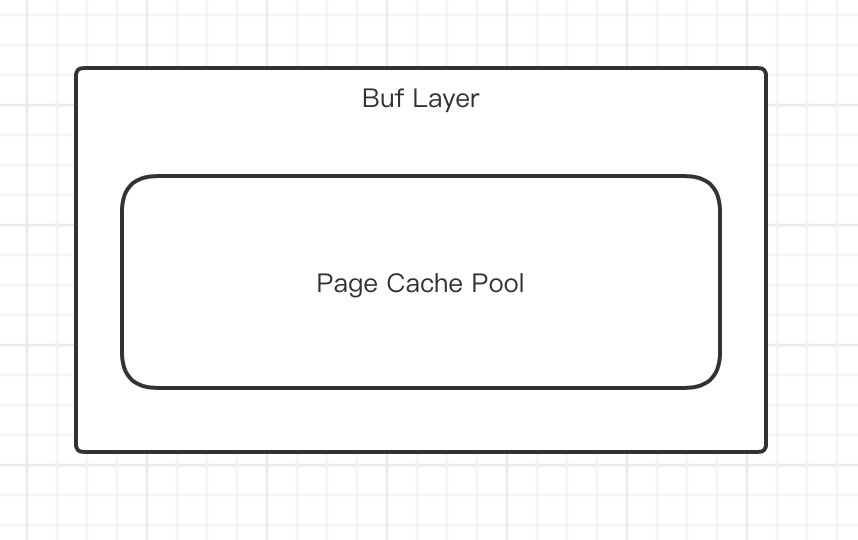

# Buf Layer

## 基本设计

Buf Layer中包含一个LRU结构的缓存池，当缓存池满后，选择最近最久未使用的数据予以淘汰。缓存池中以一个page中的数据为单位缓存。当读取某一page的数据时，根据局部性原理，会读取相应block中的所有page并一起放入缓存池中。当写入page或擦除一系列page时，会更新缓存中的数据，并将对物理存储的一系列更新操作同步到文件系统架构的下层。

## 层次结构

## 功能实现

### BufCache

#### 相关数据结构

**Buf**

* address
* data

缓存池中缓存的数据项，与物理存储中具体page的数据保持一致。

**BufCache**

* capacity
* cache
* translation_layer

缓存池的容量默认为1024，即最多可以缓存1024个page，cache是一个lru数据结构的泛型实现，translation_layer是文件系统下层的数据结构。

#### 关键函数

**read**

读取一个page的数据，当缓存命中时，直接从缓存池中读取。当缓存未命中时，调用Translation Layer中的函数读取数据，并一次读取一个block的数据内容，将新读取的数据插入缓存池。

**write**

调用Translation Layer中的函数写入一个page的数据，当缓存池中包含该page时，同步更新缓存。

**write_block_direct**

调用Translation Layer中的函数写入一个block的数据，当缓存池中包含该block中的某个page时，同步更新缓存。这个方法可以绕过Translation Layer中的写缓存，保证数据可以直接同步到物理存储中。

**erase**

调用Translation Layer中的函数擦除某个block，当缓存池中包含该block中的某个page时，同步更新缓存。