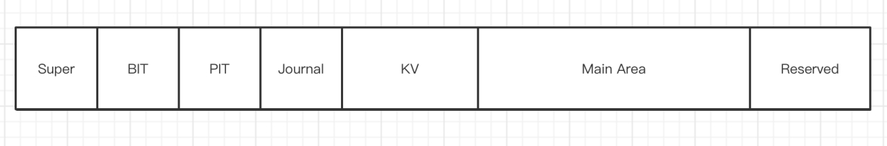

### Super Region

只读区域，记录文件系统元数据

### BIT Region

每32字节对应Main Area区域一个block的使用情况

16字节128位 0 clean 1 used/dirty

4字节 上次擦除时间

4字节 擦除次数

4字节 块平均生命周期

Tips：当修改过程发生断电，文件系统重新挂载后发现第二个Block有数据，就写入第一个Block，并清空第二个Block，保障原子性

### PIT Region

存储Main Area区域page的使用情况

0 未使用 u32 page中所存储数据对应inode的ino

两种存储编码：serial、map

serial适用于使用中的page数量多的情况

map适用于使用中的page数量少的情况

### Journal Region

垃圾回收的日志区域，记录垃圾回收的日志，实现垃圾回收时的掉电保护

### KV Region

核心Region，使用LSM-Tree实现，能进行的优化非常多。LSM-Tree自身的更新特性契合Flash异地更新的需求

相比传统的B-Tree，LSM-Tree具备有以下的特性：

* LSM-Tree具备批量写入特性，能够将小数据的random write化为sequence batch write来适配flash的特性，从而提高写性能
* 以append-only的形式添加数据，而不是update-in-place，这样的形式可以避免因为一小部分数据的修改引起flash中大量的page数据进行迁移

实现下列键值对的存储：

- 给定ino，返回inode对应的所有文件元数据
- 给定路径，返回路径该路径下包含的ino和文件名称，若该路径对应的文件是目录文件，返回的是ino和文件名称列表，若该路径对应的文件是普通文件，返回的是单个ino和文件名称

给定/home/a.txt路径获取inode的过程示例1：

- 取出/根目录，根目录的ino为1
- 根据ino为1从KV中取出/根目录的元数据，/根目录的元数据包含了/根目录文件所有数据块的位置，读出/根目录的所有数据块，就可以知道/根目录下包含了哪些文件
- 找到/根目录下的home文件，home文件也是目录文件，home文件的ino记录在/根目录的数据块中，假设为2
- 根据ino为2从KV中取出/home文件的元数据，根据元数据读出/home的所有数据块
- 找到/home目录下a.txt文件的ino，假设为3
- 根据ino为3从KV取出/home/a.txt的元数据，构造inode并返回

给定/home/a.txt路径获取inode的过程示例2：

- 取出/根目录
- 根据/根目录从KV中取出/根目录下的所有文件名
- 找到/home文件
- 根据/home从KV中取出/home下所有的文件名
- 找到/home/a.txt，取出ino
- 根据ino从KV中取出/home/a.txt的元数据，构造inode并返回

Tips：实例2是依据KV系统对访问某一路径下文件的优化，如果KV只存储Inode的元数据，那么需要多次读取目录文件的数据块，造成一定开销。这里和OSDI那篇论文是不完全一样的，那篇论文KV中存的是路径和ino，文件名称的对应关系，inode需要去disk中读，我们这里把所有文件元数据都存在了KV中

### Main Area

在Flash介质中占据最大部分，以Page为单位存储文件数据值得一提的是，Main Area中只存储文件的数据内容，文件的元信息全部交给KV Region管理

### Reserved Region

坏块管理，存储LBA/PBA表

存储数据的校验签名信息给

GC和Wear Levelling留下极大的腾挪空间

减少写入放大