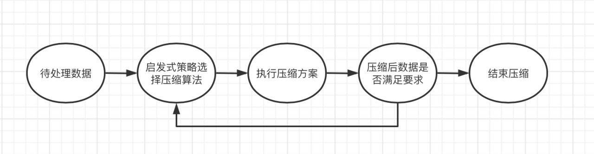
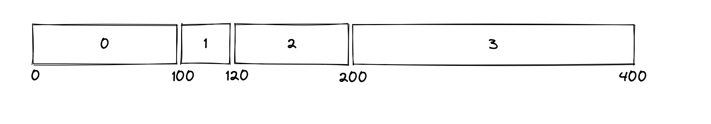

# Inode Layer

## 基本设计

Inode Layer是文件系统的重要一个层次，在Inode Layer数据被组织成文件管理，对上提供inode的视图。Inode的术语可能有两个含义，一个可能指的是包含文件元信息和数据块位置的磁盘数据结构，在WondFS，我们将Inode的磁盘结构称为Raw Inode，并放在KV Region中通过LSM-Tree进行管理。我们在这里提到的Inode指的是内存中的Inode，不仅包含了磁盘上Raw Inode包含的所有信息，还有额外的在内存管理需要的额外信息。

值得一提的是，Raw Inode中数据块的地址存储的是LBA，也就是逻辑地址，根据逻辑地址通过Translation Layer可以读取数据块。但是Inode中数据块的地址存储的并不是LBA，而是通过Core Layer中的VAM组件抽象出来的虚拟地址。VAM组件存储了逻辑地址和虚拟地址之间的映射关系。之所以需要抽象出虚拟地址的概念，这是因为在WondFS的GC中，GC位于Core Layer层次，这意味着，当一个inode处于打开的情况下，如果GC改变了这个Inode中某些数据块的逻辑地址，只需要在内存中改变VAM的映射关系。这对于架构设计来说是非常合理的，因为VAM和GC处于同一架构层次，他们之间的互相调用都是允许的，但是Inode Layer位于Core Layer的上层，GC对于逻辑地址的改变不应该通过调用上层函数的方式将影响传导到Inode中。上层可以调用下层，下层不允许调用上层，这对于架构设计的稳定性和合理性有极大的约束性帮助。

## 主要功能

### 管理Inode

通过Inode Manager实现对Inode的管理，当系统打开文件后，需要将Inode缓存在内存中，以加快之后的访问。并且通过Inode Manager实现创建新的Inode操作。

### 数据压缩

为了节省Flash存储空间，我们会对存储在文件中的数据进行压缩。目前WondFS已经支持霍夫曼和Snappy压缩算法，后续会再支持1-2种压缩算法。

霍夫曼编码算法是数据压缩中经典的一种算法。算法基于二叉树构建编码压缩结构，根据文本字符出现的频率，重新对字符进行编码。Snappy是谷歌基于LZ77算法思想编写出的压缩解压缩库，其目标并非最大压缩率或或与其他压缩程序库的兼容性，而是非常高的速度和合理的压缩率。在我们的实际测试中也表明，Snappy算法在有着极强性能的同时也拥有着不俗的压缩率。虽然，WondFS在运行过程中会依据实际数据和一系列参数动态的选择最优压缩算法。但由于Snappy算法过于强悍，在大多数情况下，Snappy算法都会是WondFS进行数据压缩的第一选择。

下图是当写入新数据后进行压缩处理的流程示意图。

数据压缩不仅需要考虑压缩后数据大小的合理性，还需要平衡计算性能与Flash写入性能。我们在选择数据压缩方案时，会综合考虑压缩算法的计算速率期望，磁盘写入速率期望，压缩算法压缩比期望，从而达到理论最优解，压缩后会对压缩结果进行检查，如果不满足预期会选择其他压缩算法或选择不对数据进行压缩。

### 数据读写

Inode Layer需要实现对文件数据读写的管理。对于上层应用来说，文件的数据是连续的。简单来说，假设文件的大小是n bits，上层应用只会说读取0-9 10个bits的内容，或者在第3个bit的位置插入或写入10bits的数据。但是实际上数据在磁盘中的地址并不是连续的，而是可能分散在各个地方。下图是一个Inode数据示例。

这个Inode中的数据由4个Entry组成，每个Entry都有一定的长度，在WondFS中，每个Entry都各自连续的存储在磁盘中。假如需要读出offset 50到offset 130的数据内容，就需要读取0、1、2Entry。

在WondFS中，会将对Inode的任何修改都生成一个InodeEventGroup，并传递至Core Layer中，以持久化修改。

下面会简单介绍WondFS的实现思路。

InodeEventGroup标志着一次Inode修改，通过InodeEventGroup的抽象可以使得WondFS的对于文件的处理可以是流水化的，具有极强的拓展性。这同样也是WondFS的众多创新之一。如果Inode Layer不生成InodeEventGroup，不将需要进行的一系列修改打包到Core Layer，而是在Inode Layer自行处理修改，则需要处理所需要持久化和所需要修改WondFS中的一系列行为。这不仅会造成Inode Layer的函数及其臃肿，每个函数都要需要调用众多底层函数，增加debug的难度和观感，更为糟糕的是这意味着Inode Layer需要理解Core Layer的所有逻辑。这意味着每个层次的权限是不清晰的，每个层次混杂在一起，这对架构设计上来说是一种不合理的行为。通过合理抽象出InodeEventGroup这一概念，这使得Inode Layer只需专注文件本身，局限于自己本应该只关注的区域和角度。

InodeEventGroup结构体中包含了三部分，inode存储了需要处理的Inode，need_delete标志了是否需要删除Inode，events存储了InodeEvent数组，即需要对Inode进行的一系列事件操作。

InodeEvent是一个枚举类型，可以表示对文件的所有操作。AddContentInodeEvent对应增加一个Entry的操作，TruncateContentInodeEvent对应对某个Entry的截断操作，ChangeContentInodeEvent表示对Entry位置的修改，DeleteContentInodeEvent表示删除某个Entry的操作，ModifyInodeStatInodeEvent表示对于Inode元数据的修改。

接下来，我们会以具体的例子来说明在WondFS中如何实现InodeEventGroup的生成，这也是Inode Layer的核心功能之一。

在上面的Inode示例中在offset 80的位置覆盖写入100bits的数据生成的InodeEventGroup：对0Entry添加TruncateContentInodeEvent，截断offset 80到offset 99的数据，在0Entry和1Entry插入一个Entry，添加AddContentInodeEvent实现添加一个100bits长度的Entry，对1Entry添加DeleteContentInodeEvent，删除1Entry，对2Entry添加DeleteContentInodeEvent，删除2Entry，继续添加一个AddContentInodeEvent，将2Entry原先offset 180到offse 199的数据作为一个新的Entry插入。

在上面的Inode示例中从offset 80开始，删除100bits的数据生成的InodeEventGroup。对0Entry添加TruncateContentInodeEvent，截断offset 80到offset 99的数据，对1Entry添加DeleteContentInodeEvent，删除1Entry，对2Entry添加DeleteContentInodeEvent，删除2Entry，添加一个AddContentInodeEvent，将2Entry原先offset 180到offse 199的数据作为一个新的Entry插入，对3Entry添加ChangeContentInodeEvent，将3Entry的起始offset减去100。

## 功能实现

### InodeManager

* size
* capacity
* inode_buffer
* lock
* core_manager

size是打开的inode数量，capacity是Inode Manager支持的最多打开文件数，默认情况下最多在内存中打开30个文件。lock是锁，控制InodeManager在并发情况下的数据安全。core_manager持有下层的控制管理类。inode_buffer存储打开的文件。

**i_alloc**

调用core_manager的allocate_inode方法创建一个新的inode，存储在inode_buffer中，并返回打开后的文件。

**i_get**

根据ino获取inode。如果inode已经被打开，则将其ref_cnt加1后返回inode。如果inode还没被打开，调用core_manager的get_inode方法获取inode，将其存储在inode_buffer中，并返回打开后的文件。

**i_dup**

将inode的ref_cnt加1。

**i_put**

将inode的ref_cnt减1，删除对内存中inode的一个引用，如果这是最后一个引用，那么inode在inode_buffer中的空间就可以被回收，关闭文件。

### Inode

#### 相关数据结构

**InodeEntry**

* file_type
* ino
* size
* ref_cnt
* n_link
* mode
* uid
* gid
* last_accessed
* last_modified
* last_metadata_changed

存储Inode中的一个数据项。

**Inode**

* file_type
* ino
* size
* ref_cnt
* n_link
* mode
* uid
* gid
* last_accessed
* last_modified
* last_metadata_changed
* lock
* data
* core

core持有下层的Core Manager，在Rust中使用Arc和Refcell和Inode Manager实现共同持有。data存储InodeEntry数组。

#### 关键函数

**read_all**

读出inode文件中的所有数据。

**read**

读出inode文件中指定范围的数据。

**write**

在inode文件的指定位置覆盖写入一定长度的数据。

**insert**

在inode文件的指定位置插入一定长度的数据，不会覆盖原有的数据。

**truncate**

删除inode文件的指定范围的数据。

**truncate_to_end**

删除inode从指定位置开始的所有内容。

**get_stat**

获取inode的元信息。

**modify_stat**

修改inode的元信息。

**delete**

删除inode文件。